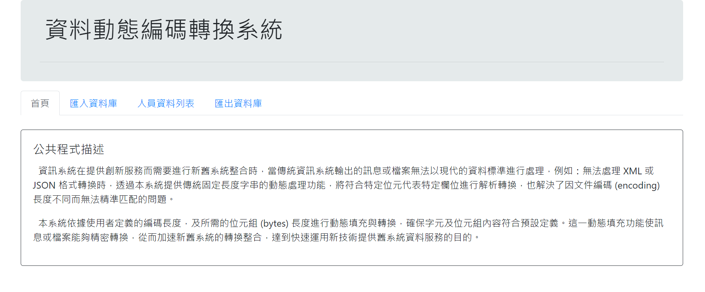
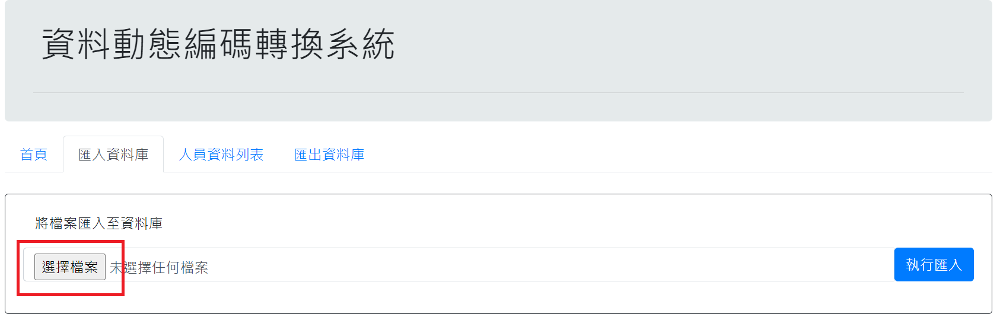
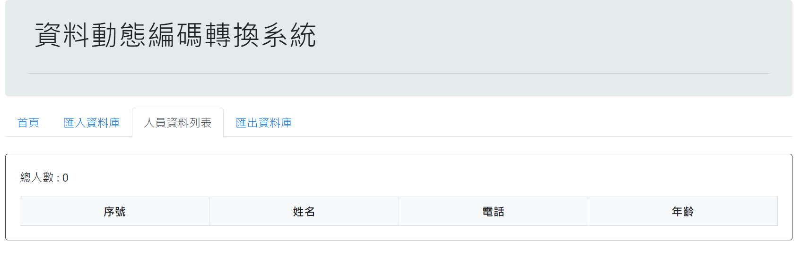
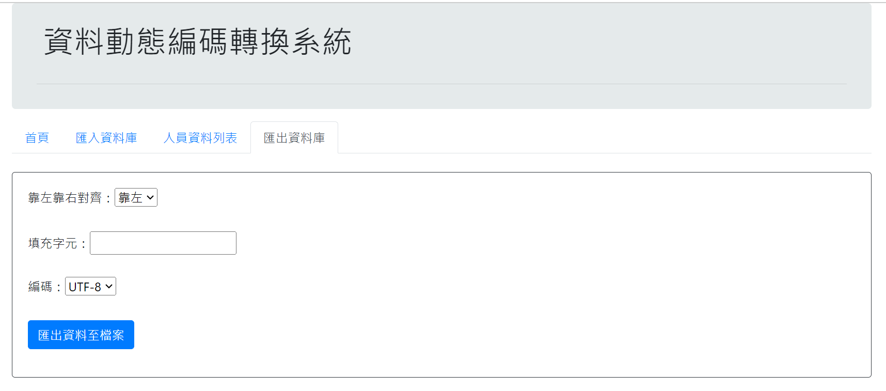
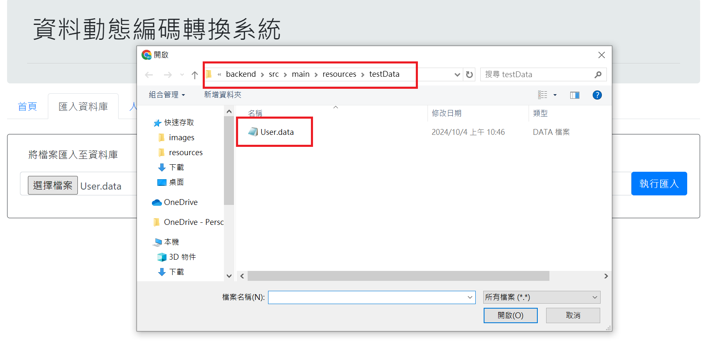
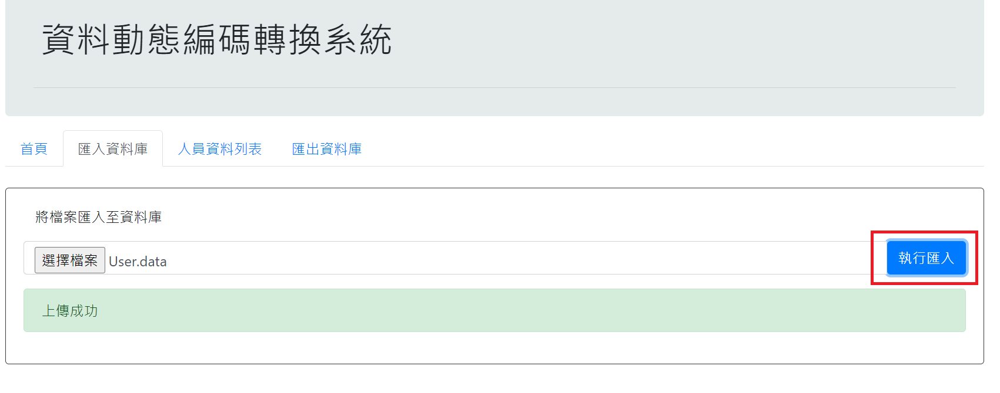
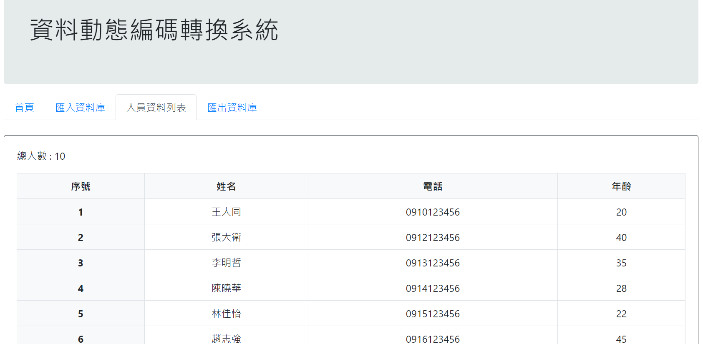
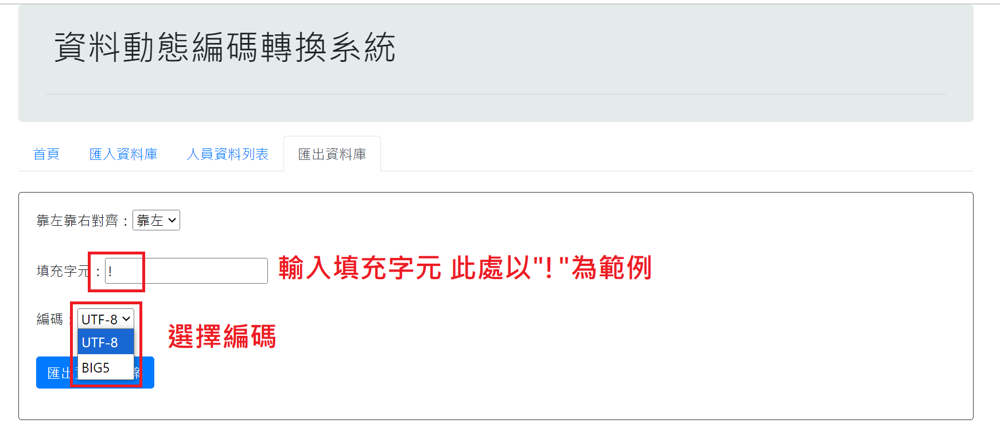
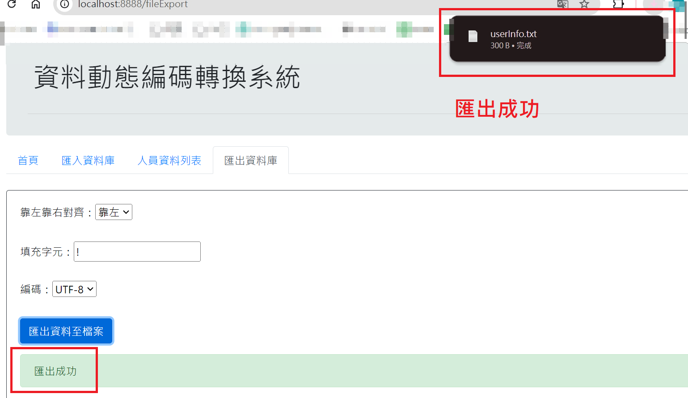
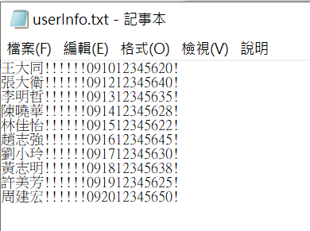

## 智能數據解析及擷取

> 本共用元件旨在根據設定檔的定義，從原始數據檔（row
> data）中精確擷取與還原所需的欄位資訊，以便進行後續的數據處理與分析。此外，若源頭的數據長度發生變化，無需修改程式碼，只需在設定檔中調整欄位的長度，即可完成數據解析的更新，提升維護的靈活性與效率。
>

## 1.所用技術

- Spring Boot
- Spring Data JPA
- Hibernate
- H2 Database Engine
- Swagger
- Vue3

## 2.安裝指南

> 請確保您的環境中安裝有 Java 18 及 Maven 3 以上版本

```bat
# 執行步驟
> git clone https://gitlab.iisigroup.com/ps150/g-p231301/modapc/byteextractproject.git
> cd byteextractproject
> mvn clean package
> java -jar target/byteExtractProject-0.0.1-SNAPSHOT.jar
```

## 3.使用情境範例

> 系統需從大量的原始數據檔案中提取客戶資訊。透過「智能數據解析及擷取」元件，使用設定檔來定義每個資料欄位的長度，能快速且準確地解析出客戶的姓名和年齡等資訊。
>
> 匯出工具提供的動態填充功能，旨在依照指定的字符集，對檔案內容進行字元級填充操作，使其能夠根據設定檔預設的 byte 大小進行擴展或補全。
> 考慮到字符編碼在不同 byte 編碼模式下對實際佔用空間的影響，並自動調整填充策略以確保最終輸出的字節流與目標規格完全一致。

- 設定檔 ./backend/src/main/resources/config.properties

```properties
#擋頭.欄位=起始位置,擷取長度(bytes)
USER.NAME=0,15
USER.PHONE=15,10
USER.AGE=25,3
```

- 測試資料檔位置：
  ./backend/src/main/resources/testData/User.data
- 內容範例：
  (<span style="font-size:12px;">編碼格式：此範例檔案使用 UTF-8 編碼，中文字符每個佔 3 個 byte，英文字符和數字佔 1 個
  byte。</span>)

```plaintext
王大同      0910123456 20
張大衛      0912123456 40
李明哲      0913123456 35
陳曉華      0914123456 28
林佳怡      0915123456 22
趙志強      0916123456 45
劉小玲      0917123456 30
黃志明      0918123456 38
許美芳      0919123456 25
周建宏      0920123456 50           
```

## 4.結果展示






## 5.功能操作展示
> - 匯入資料庫
  
> - 選擇測試檔案
  
> - 上傳成功
  

> - 檢視匯入資料
  

> - 匯出
  
>- 選擇對齊方式與編碼
  
>- 匯出成功
  
>- 匯出檔案預覽
  